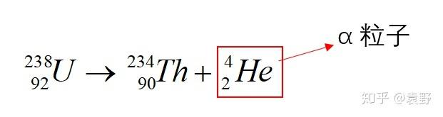
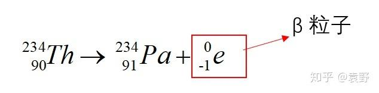
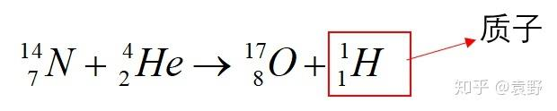
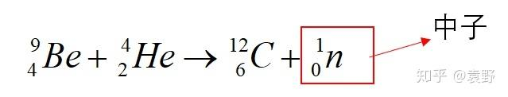
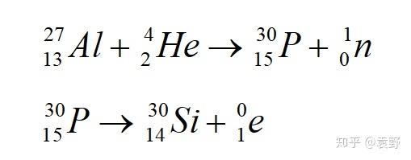
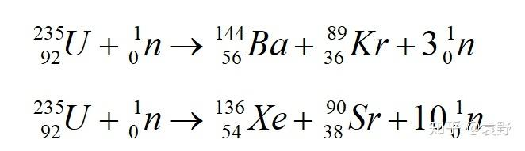
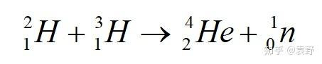
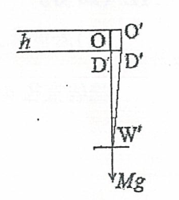

# 2022物竞预赛

备战物竞！目标复赛！

## 考后补充

预赛过了，二百五十多，我们学校正录取的最后一名。

39届还有很多题都不太行，后面会补充。

<!-- More -->

## 38届预赛错题回顾

### T-1

对于弹簧振子，假设其所受力为$F=-kx$，则系统总势能为$E_p=\frac{1}{2}kx^2$。

对于此题，在势能最大时，物块位移达到最大值，此时受力分析得到：
$$
F=\mu mg+k\Delta x
$$

于是得到
$$
E_p=\frac{1}{2}k{\Delta x}^2=\frac{(f-gmu)^2}{2k}
$$

题中所给信息中，“平衡位置”的含义似乎有些不明不白。此处“平衡位置”指摩擦力$f=0$并且弹簧位移为$0$的时候。

还有一个令人感到迷惑的点就是在物块位移最大时的受力。实际上因为$F$是恒力，在物块$v\neq 0$有以下方程成立（向右为正方向）：
$$
F-kx-\mu mg\frac{v}{|v|}=ma
$$

注意到在刚开始拉动的时候，$v>0$，故$\frac{v}{|v|}=1$。

当$F=kx+\mu mg$时，$a=0$。以这个点为平衡位置，有$F_{all}=-k'\delta x$，满足简谐振动的规律。

一旦$v<0$，$F-kx+\mu mg=ma$，物块很快又向正方向运动。同样选取$F-kx+\mu mg=0$的点为平衡位置，有$F_{all}=-k''\delta x$，满足简谐振动的规律。

也就是说，该物块实际上在做一个有阻尼的谐振。在这样的情形下，势能最大时，静摩擦力$f$的方向和大小可能就不太好判断了，只是满足$f\in [-\mu mg, \mu mg]$（假设最大静摩擦力等于滑动摩擦力）。

**本题未结**

### T-3

首先介绍经典理论下的氢原子光谱。

> 根据卢瑟福的原子模型，核外电子在核的库伦场中运动，受到向心力作用，因而做周期性的圆轨道或者椭圆轨道运动。
> 
> 设只有一个电子绕原子核做圆轨道运动，轨道半径为$r$，则电子的动力学方程为：
> $$
> \frac{Ze^2}{4\pi \varepsilon_0 r^2}=\frac{m_ev^2}{r}
> $$
> 其中，$Z$为核电荷数。由上式得到电子的动能为：
> $$
> \frac{m_ev^2}{2}=\frac{1}{2} \frac{Ze^2}{4\pi \varepsilon_0 r}
> $$
> 电子轨道运动的频率为
> $$
> f=\frac{v}{2\pi r}=\frac{e}{2\pi }\sqrt{\frac{Z}{4\pi \varepsilon_0m_er^3}}
> $$
> 原子的能量包括电子的动能$E_k$和电子与核之间的库伦势能$E_p$，其总能量为
> $$
> E=E_k+E_p=\frac{m_ev^2}{2}-\frac{Ze^2}{4\pi \varepsilon_0 r}=-\frac{1}{2} \frac{Ze^2}{4\pi \varepsilon_0 r}
> $$
> 按照经典电磁学理论，带电粒子做加速运动，向外辐射电磁波，其电磁辐射频率等于电子的运动速率。
> 
> 由于轨道半径$r$的取值并不受限制，故光谱应当为连续谱，原子的能量也可以是连续值。
> 
> 由于向外辐射能量，原子的能量将不断减少，电子的轨道半径将不断缩小，最终将会落到核上，即所有原子将“崩塌”。但这与实验的事实不符。因此无法使用经典理论解释核外电子运动情况。
> 
> ——《热学·光学·近代物理学》第2版

在实验中，光谱都是连续的，而且原子并不会湮灭，所以可见卢瑟福模型是有问题的。于是玻尔在1913年提出了一套全新理论——玻尔的氢原子模型。

> 玻尔提出了三个基本假设：
> 
> **定态条件**
> 
> 原子中的电子只能位于一系列分立的圆轨道上，绕核运动；电子在固定的轨道上运动时不向外辐射电磁波。这些分立的轨道称为定态轨道，其半径可以记为$r_n$，则由上面得到的原子能量表达式，得：
> $$
> E_n=-\frac{1}{2} \frac{Ze^2}{4\pi \varepsilon_0 r_n}
> $$
> 
> 由于原子轨道是分立的，故原子的能量也是分立的，即量子化的。这些量子化的能量称作能级。
> 
> 此时因为电子在定态轨道上不辐射电磁波，所以原子的能量是不变的，电子不会因为辐射电磁波而落入核内。
> 
> **频率条件**
> 
> 电子可以在不同的定态轨道之间跃迁，原子的能量也发生相应的改变，即原子可以在不同的能级之间跃迁。当原子的能量改变时，就以电磁波的形式辐射或吸收能量。
> 
> 根据已有的爱因斯坦光量子的能量表达式$E=h\nu $，其中$\nu $为电磁辐射的频率，原子从定态$E_{n_1}$跃迁到另一个定态$E_{n_2}$时，与电磁辐射频率之间的关系为
> $$
> h\nu =E_{n_1} - E_{n_2}
> $$
> 
> 将定态条件中得到的$E_n$表达式代入可得：
> $$
> h\nu =-\frac{1}{2} \frac{Ze^2}{4\pi \varepsilon_0 }(\frac{1}{r_{n_2}}-\frac{1}{r_{n_1}})
> $$
> 
> 将电磁辐射的能量和里德伯方程（描述原子光谱的一个方程） $\tilde{v} =R_H (\frac{1}{n^2_2}-\frac{1}{n^2_1})=T(n_2)-T(n_1)$ 联系起来可以得到
> $$
> h\nu =h\frac{c}{\lambda }=hc\tilde{v} =hcR_H (\frac{1}{n^2_2}-\frac{1}{n^2_1})
> $$
> 
> 对于氢原子，$Z=1$，于是有
> $$
> E_n=-\frac{hcR_H}{n^2}=-hcT(n)
> $$
> $$
> r_n=\frac{1}{2} \frac{e^2}{4\pi \varepsilon_0 hcR_H}n^2
> $$
> 
> ——《热学·光学·近代物理学》第2版

继续往下还可以推得$R_H$的精确值和氢原子最小电子轨道半径等等。此处略过，仅需知道（非本题所需）第$n$能级的电子轨道半径是第一能级轨道半径的$n^2$倍即可。剩下的之后再议。

由于电子的质量很小，忽略氢原子中质子的运动。但是当绕核旋转的物质质量较大时，不可以使用该近似处理，需要在质心坐标系中考虑。（也非本题必需，仅仅补充知识点）

现介绍折合质量（在两体问题中常用，证明略去，见原文）：
> 当我们研究两个相互作用的质点组成的系统的运动时（如A和B），两个物体都在动，研究起来比较麻烦。
> 为了简化，尝试将一个物体（A）视为静止，只观察另一物体（B）的运动。在新的参考系下，B的质量为折合质量$\mu$
> $$
> \mu=\frac{m_Am_B}{m_A+m_B}
> $$
> 
> ——[《什么是折合质量？》徐皮皮](https://zhuanlan.zhihu.com/p/478231822)

反观本题，氢原子基态能量是告诉我们
$$
-\frac{1}{2} \frac{e^2}{4\pi \varepsilon_0 r}=-13.6eV
$$

对于两个电子的束缚态，我们不妨假设绕质心转动的半径仍然为$r$，对于单个电子分析，势能为
$$
E_p=-\frac{e^2}{4\pi \varepsilon_0 r}
$$
动能为（用匀速圆周运动受力$F_q=m\frac{v^2}{r}$代入$E_k=\frac{1}{2}mv^2$可以得到）：
$$
E_k=\frac{e^2}{8\pi \varepsilon_0 r}
$$

单个电子总能量即为：
$$
E=-\frac{e^2}{8\pi \varepsilon_0 r}
$$

由此看出，两个电子的总能量是氢原子能量的一半。得到答案。

### T-4

完全就是概念题。参见百度百科

> 放射性元素的原子核有半数发生衰变时所需要的时间，叫半衰期（Half-life）。随着放射的不断进行，放射强度将按指数曲线下降，放射性强度达到原值一半所需要的时间叫做同位素的半衰期。
> 原子核的衰变规律是：$N=N_0×(\frac{1}{2})^\frac{t}{T}$其中：$N_0$是指初始时刻（$t=0$）时的原子核数，$t$为衰变时间，$T$为半衰期，$N$是衰变后留下的原子核数。放射性元素的半衰期长短差别很大，短的远小于一秒，长的可达数百亿年。
> 在物理学中，尤其是高中物理，半衰期并不能指少数原子，它的定义为：放射性元素的原子核有半数发生衰变所需的时间。衰变是微观世界里的原子核的行为，而微观世界规律的特征之一在于“单个的微观事件是无法预测的”，即对于一个特定的原子，我们只知道它发生衰变的概率，而不知道它将何时发生衰变。然而。量子理论可以对大量原子核的行为做出统计预测。而放射性元素的半衰期，描述的就是这样的统计规律。
> 放射性元素衰变的快慢是由原子核内部自身决定的，与外界的物理和化学状态无关。
> 
> ——[百度百科-半衰期](https://baike.baidu.com/item/%E5%8D%8A%E8%A1%B0%E6%9C%9F/288174?fr=aladdin)

### T-9

此题需要掌握的知识：

1. 湿度（相对湿度），空气中实际水汽压与当时气温下的饱和水汽压之比。
2. 理想气体遵循：$pV=nRT$，$T$为热力学温度。
3. 容器气体压强等于各气体分压之和。
4. 干燥空气是理想气体，但湿空气不是；湿空气的压强为当前温度下水的饱和蒸气压。

### T-14

对于几何光学，一定要把所有像的位置都讨论一下，不要漏下。

另外掌握两个公式：

透镜成像规律
$$
\frac{n_u}{u}+\frac{n_v}{v}=\frac{n_u-n_v}{r}
$$
其中$u$为物距，$v$为像距，$n_u$为物方折射率，$n_v$为像方折射率，$r$为透镜曲率半径。对于$u$和$v$来说，实正虚负；对于$r$来说，凹正凸负（指面对物方的凹凸性）。

放大率$\beta$
$$
\beta =-\frac{n_uv}{n_vu}
$$

本题仅需第一个公式可解决。注意：凹凸面镜反射等于二次折射，因为面镜的反射集中在一个面的涂漆（想象一下家里的镜子涂漆）。所以其实可以介绍第三个公式：
$$
\frac{1}{u}+\frac{1}{v}=\frac{2}{r}
$$

### T-15

首先，气体的质量不直接作用在接触面上，而通过气体压强传递。

其次，对于理想气体，从外界吸收的热量$Q=\Delta U - \Delta W$，恒温状态下$\Delta U=0$。并且请不要忘记考虑水的汽化热，并且请不要忘记B室内气压不变。

所以本题第二小题的式子可以列为：
$$
Q_{in}=\Delta nM\cdot L+p\Delta V
$$

## 37届预赛错题回顾

### T-11

本题不能将大气看做一个电容。。。不知道为什么做题的时候把它当做电容算了。。很明显两“极板”之间都导通了还做个毛线。

有欧姆定律：
$$
R=\frac{U}{I}
$$

根据电流定义式，
$$
I=\frac{dq}{dt}
$$

因为$50km \ll 6400km$，即大气高度远远小于地球半径，所以因为半径增大而导致“电阻”横截面积的增大可以忽略。则：
$$
R=\rho \frac{l}{S}
$$

故
$$
\rho =\frac{4\pi r^2R}{l}\approx 1.7\times 10^{12}\Omega \cdot m
$$

电功率好算：
$$
P=UI=5.4\times 10^8W
$$

### T-13

在知道了问题关键是画图和全反射后，本题容易通过画图解决。

### T-14

这道题有些模棱两可。计算过于复杂，暂时不解。

**本题未结**

## 36届预赛（浙江赛区）错题回顾

错题有些多（太难了，浙江省太狠了），先放一放。

**本篇未结**

## 35届预赛错题回顾

### T-1

介绍一下核反应（参考：[《四种核反应类型的对比分析》袁野](https://zhuanlan.zhihu.com/p/130446803?ivk_sa=1024320u)）

（1）衰变

α衰变，放出α粒子（氦原子核）：

β衰变，放出β粒子（电子）：

【特点】重核放出α粒子或β粒子，但是不是所有有α粒子或β粒子生成的就是衰变，注意和后面讲到的区别开来。

而这两者都可能放出$\gamma$，也就是光子。实际上是放出的能量以电磁波的形式散发。

（2）人工转变

卢瑟福发现质子：

查德威克发现中子：

居里夫妇发现放射性同位素和正电子：

【特点】一般是用α粒子高速撞击原子核发生的反应。

【补充】卢瑟福与α粒子的缘分：

1898年，卢瑟福发现了α粒子。

1911年，卢瑟福用α粒子轰击金箔发现了原子核式结构。

1919年，卢瑟福用α粒子轰击氮原子核发现了质子。

1932年，卢瑟福学生查德威克用α粒子轰击铍核发现了中子。

（3）重核裂变

【特点】中子轰击重核生成两种中等质量核，同时放射出中子的核反应。

放射出的中子可以再度轰击重核，产生连续反应，称为链式反应。

【补充】重核反应是核电站工作的原理，但是在实际运行中，需要解决以下问题：

1.重核裂变会产生多个中子，中子再次撞击重核发生裂变，产生更多的中子，导致反应规模指数上升，不可控。

2.裂变产生的中子为快中子，也不利于铀核吸收。

3.存在辐射，对人有害。

（4）轻核聚变

【特点】两个轻核在高温高压下发生的核反应。

【补充】太阳内部的反应。

好了，就讲这么多吧，不再拓展说明了，关于上面的核反应方程式，也不一定要背出来，只要学会区分，并且掌握书写原则即可。总结一下就是：

### T-4

首先要知道误差在于地磁场，所以必须要反转磁场方向才能抵消，故选CD。

### T-11

注意受力分析时一定要把所有力和力矩搞清楚，搞清楚再做题。

而且取极值的时候一般就两个套路：力大于$0$，函数极值。注意“力大于$0$”是必要条件，一定要先满足！

## 34届预赛错题回顾

### T-3

> 核子数核子是质子、反质子、中子和反中子的总称，是组成原子核的粒子。它由夸克和胶子组成，属于重子。在中学阶段，可以认为核子数等于原子的质量数。

所以易得。

### T-4

看清楚角度到底指哪个角应该就好做了。

### T-6

首先，该小球是不发生转动的。其次，所需时间是$\frac{T}{4}$，而不是$\frac{T}{2}$。所以抽象为单摆处理：
$$
t=\frac{T}{4}=\frac{1}{4}\cdot 2\pi \sqrt{\frac{l}{g}}\approx 2.2s
$$

### T-10

答案：不守恒

原因：墙壁对弹簧有作用力（外力），且在运动参考系中，该力的作用点有位移，所做的功不为零。

真不知道为什么当时在想关于相对论的事情……

### T-11

实际上这个装置能支撑的矿泉水的数量是没有限制的，除非绳子断裂或者火柴断裂。而且不管重物有多重，装置的$\theta$角不会改变。原理就是通过转动让矿泉水的重力对$O$的力矩为$0$。

这时需要考虑棉线的直径。转过一个角度后，水瓶左移$\frac{d}{2}$，使得重力线过$O$。剩余为几何问题。

即使棉线旋转后物体重力线能过$O$，我们只需要令转过的角度
$$
sin(\theta )=\frac{DD'}{D'W'}
$$

即
$$
sin(\theta )=\frac{\frac{d}{2}}{\frac{ \sqrt{3} }{2} l-h}
$$

### T-14

确定平衡状态：$y$方向电流密度$j_y=0$。

然后确定每个载流子的运动状态：
$$
V_{p_y}=\mu_p(-E_y-B_ze\mu_pE_x)
$$

$$
V_{n_y}=-\mu_n(E_y-B_ze\mu_pE_x)
$$

其中$E_x$可以用$j_x$表达。这里用到了等效电场：实际上洛伦兹力提供的力可以看做一个$y$方向的电场，这样就可以用上题中所给的$\mu_p$和$\mu_n$了。

### T-16

首先得出$d\alpha$和$dy$（$y$为纵向，向下为正）的关系式：
$$
cos\alpha_0dy=l_0d\alpha
$$

然后再求原长$L$：
$$
2(l_0-L)ksin\alpha_0=mg
$$
$$
L=l_0-\frac{mg}{2ksin\alpha_0}
$$

现对于一个微小位移$dy$，求位移后的弹性绳的长度$l$：
$$
l^2=l_0^2cos^2\alpha_0+l_0^2sin^2\alpha_0+2l_0sin\alpha_0dy+dy^2\approx l_0^2+2l_0sin\alpha_0dy
$$

再求出新的角度$\alpha$下它的正弦值：
$$
sin(\alpha_0+d\alpha)=sin\alpha_0cos\alpha +cos(\alpha_0)d\alpha \approx sin\alpha_0+cos\alpha_0 d\alpha =sin\alpha_0+cos^2\alpha_0 \frac{dy}{l_0}
$$

最后列出受力分析：
$$
ma=-2(sin\alpha_0dy+l_0-l_0+\frac{mg}{2ksin\alpha_0})ksin\alpha +mg
$$

解得
$$
ma=-2k(sin^2\alpha_0+\frac{mgcos^2\alpha_0}{2kl_0sin\alpha_0})dy=-kdy
$$
$$
\omega =\frac{k}{m}
$$

## 33届预赛错题回顾

### T-4

需要注意，右边有挡板，力可以为无限大。

对于$q<0$时，可以画出弹簧的弹力$F=kx$与库仑力$F=\frac{Qq}{4\pi \varepsilon_0 r^2}$的$F$-$x$图像，看交点个数判断平衡位置。

### T-7

两种做法：1.精准绘图；2.实际上两波在此处的相位差为$\frac{\pi }{3}$或$\frac{2\pi }{3}$即可。

### T-10

上面的一份题中提到过原子物理相关。现给出更具体的阐述。

对于原子，有角动量的公式：
$$
L=mvr_n=n\frac{h}{2\pi }
$$
其中$h$为普朗克常数，$n=1,2,3,\dots$，为能级数。

由角动量可以得到
$$
m_ev^2r_n^2=\frac{(n\frac{h}{2\pi })^2}{m_e}
$$

由轨道方程
$$
\frac{e^2}{4\pi \varepsilon_0r_n^2}=\frac{m_ev^2}{r_n}
$$
得：
$$
m_ev^2r_n=\frac{e^2}{4\pi \varepsilon_0}
$$

两式相除得：
$$
r_n=\frac{4\pi \varepsilon_0(n\frac{h}{2\pi })^2}{m_ee^2}
$$

这样可以得到能量、角速度等等物理量。

注意：当原子核和绕核运动的粒子质量相差不大时，可以将运动的粒子的质量等效为$\mu =\frac{m_1m_2}{m_1+m_2}$

### T-14

请对整个正方形进行回路方程，这样可以规避掉由于各段电动势不一样的痛苦。。。

由于对称性，只需要设两条边（$AB$，$A'B'$）上的电流为$I_1$，$I_2$即可。

并且一定要注意$A'D$和$B'C$段的电阻是并联的。。。

实际上对正方形$ABCD$和长方形$A'DCB'$列出回路方程，两个未知数两个回路方程就可以解出来了。

## 32届预赛错题回顾

总体上来说这份比较简单。

### T-6

合外力包括摩擦力。

### T-14

第一题，切向是有外力的。。。不然怎么加速得起来。其实就是第二题的那个力。。。

### T-15

请分析清楚到底哪个下降了，哪个上升了，哪个碰底了。一定要受力分析。

而且气体对活塞做的总功，受力分析一下，仅仅转化为两个活塞和上面放着的$2m$的质点的重力势能。

受力分析很重要！

## 考前叮咛

### 热力学相关

内能、做功等等

### 三大宇宙速度

推导，特别是第三宇宙速度

### 几何光学符号法则

请确立一套自己的符号法则

### 半波损失

看看沛神的巨作

### 自由程相关

也是看看沛神的巨作

### 相对论

再摸摸公式...因为平时用得少，可别大意了。

### 衰变相关

在博客里面也写了，赶紧看看！
